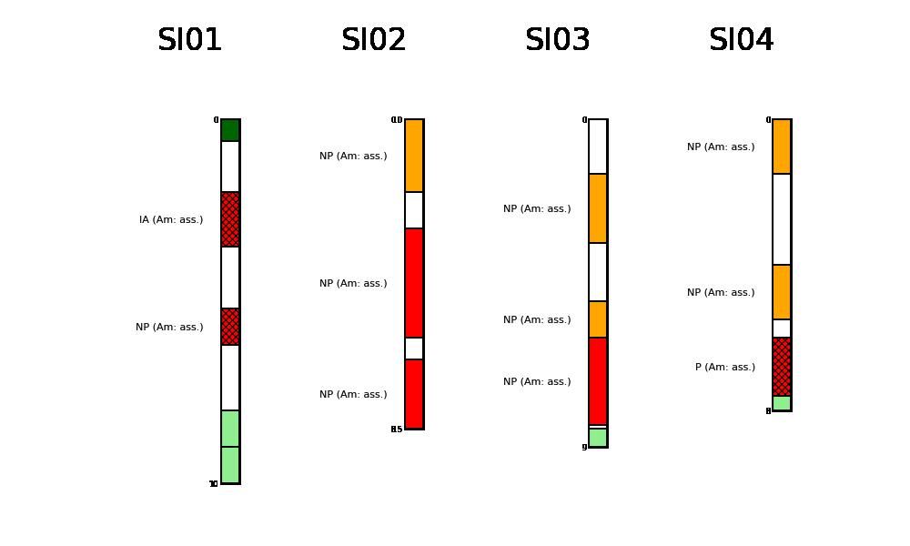

# mplStrater


[](https://requires.io/github/giocaizzi/mplStrater/requirements/?branch=main)


This package provides the possibility to plot geologic stratigraphic columns with a structured symbology and labelling system on `matplotlib` figures.

The package allows to use georeferenced rasters as basemap.


Additionally, the package has the capability to just plot the single stratigraphic columns.



## Documentation

The documentation with examples can be found [here](https://giocaizzi.github.io/mplStrater/).

## Installation (from source)

### Dependencies

Install dependencies in `requirements.txt` with `conda` or `pip`.

```
pip install -r requirements.txt
```

### Get code and install

Clone code from github and install with `pip`.

```
git clone https://github.com/giocaizzi/mplStrater.git
cd mplStrater
pip install .
```
